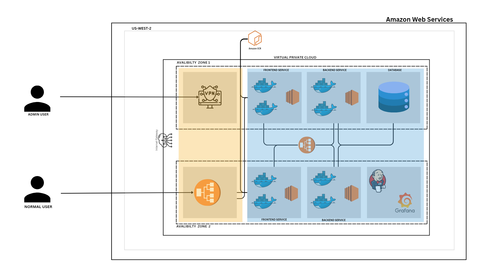

<h1>MySQL CRUD - Nodejs, Reactjs</h1>


https://github.com/mushfiqurniazzz/Mysql-CRUD-Operations-With-Nodejs-And-Reactjs/assets/148959859/c0adf4d1-336c-4ee1-b28b-c5528eb481d0


<p>This app allows users to save users with name and email with specific id for everyone, featuring functionalities like create, read, update, delete. It uses MySQL as the database to store users, Express.js for handling server-side logic, React.js for building the user interface, and Node.js for server-side runtime environment. The app provides a seamless experience for users to save users and time.</p>
<h3>Running the Project Locally</h3>
  <p>To run this project on your local machine, follow these steps:

1. <b>Clone the Repository</b>: Clone this repository to your local machine:

   git clone <repository_url>

2. <b>Navigate to Project Directory</b>: Move into the project directory:

   cd <project_directory>

3. <b>Install Dependencies</b>: Install the necessary dependencies using npm or yarn:

   npm install

   or

   yarn

4. <b>Setup Environment Variables</b>: Create a `.env` file in the root of your project directory and add the variables given in `.env.sample`

5. <b>Start the Development Server</b>: Run the following command to start the development server:

   npm start

6. <b>Access the App</b>: Open your web browser and navigate to `http://localhost:3000` for frontend `http://localhost:5000` to access the app. You can now use the app locally on your machine, connected to your MySQL database using the variables specified in the `.env` file.

7. <b>Note</b>: The project may not work if you do not install dependencies in both front end and backend. So you would have to apply step 2 and 3 twice, once in frontend and once in backend.
</p>
# AWS-3-TIER_ARCHITECTURE

# 🚀 AWS 3-Tier Architecture Deployment

## 📌 Overview
This project sets up a **secure, scalable AWS 3-tier architecture** using **Docker, AWS ECS, MySQL, Jenkins, Grafana, and CloudWatch**. It includes **CI/CD automation** with Jenkins and real-time monitoring with Grafana.

## 🔥 Architecture Diagram



## 🏗️ AWS Resources Setup

### 🔹 **Networking: 8 Subnets Across 2 AZs**
- **Public Subnets:**
  - `Subnet 1`: Public **Application Load Balancer (ALB)`**
  - `Subnet 2`: **VPN Gateway** (Optional)
- **Private Subnets:**
  - `Subnet 3 & 4`: **Frontend (React+Nginx, Deployed on ECS)**
  - `Subnet 5 & 6`: **Backend (Node.js + Express, Deployed on ECS)**
  - `Subnet 7`: **MySQL Database (Hosted on EC2 Instance)**
  - `Subnet 8`: **Jenkins (CI/CD) & Grafana (Monitoring)**

## ⚙️ **Deployment & CI/CD Flow**

### 🔹 **Jenkins Pipeline (CI/CD Workflow)**
```plaintext
1️⃣ Developer pushes code → Private GitHub Repo
2️⃣ Jenkins detects changes → Pulls the latest code
3️⃣ Builds Docker Image → Pushes to AWS Elastic Container Registry (ECR)
4️⃣ Updates Task Definition → Deploys new version in ECS
```

#### **Jenkinsfile** (Example Pipeline)
```groovy
pipeline {
    agent any
    stages {
        stage('Checkout Code') {
            steps {
                git branch: 'main', credentialsId: 'github-cred', url: 'https://github.com/user/repo.git'
            }
        }
        stage('Build Docker Image') {
            steps {
                script {
                    docker.build('my-app:${BUILD_NUMBER}')
                }
            }
        }
        stage('Push to ECR') {
            steps {
                sh 'docker tag my-app:${BUILD_NUMBER} <AWS_ACCOUNT_ID>.dkr.ecr.<REGION>.amazonaws.com/my-app:${BUILD_NUMBER}'
                sh 'docker push <AWS_ACCOUNT_ID>.dkr.ecr.<REGION>.amazonaws.com/my-app:${BUILD_NUMBER}'
            }
        }
        stage('Update ECS Service') {
            steps {
                sh 'aws ecs update-service --cluster my-cluster --service my-service --force-new-deployment'
            }
        }
    }
}
```

## 📊 **Monitoring & Logging**

### 🔹 **Grafana (Fetches Metrics from CloudWatch)**
- 📌 **Monitors ECS Task Performance:** CPU, Memory, Network Traffic
- 📌 **CloudWatch Integration for Logs & Alerts**

```plaintext
1️⃣ CloudWatch collects logs from ECS, ALB, and EC2
2️⃣ Grafana pulls CloudWatch metrics
3️⃣ Provides real-time dashboards & alerts
```

## 🔐 **Security Measures**
- **IAM Roles & Policies:** Restricted access to ECS, ECR, and S3.
- **Security Groups:** Allows only ALB-to-backend and backend-to-DB traffic.
- **Secrets Management:** AWS Secrets Manager for DB credentials.

## 🛠️ **How to Deploy**

### ✅ **Step 1: Clone the Repository**
```bash
git clone https://github.com/user/repo.git
cd repo
```

### ✅ **Step 2: Deploy Infrastructure using Terraform** *(Optional)*
```bash
terraform init
terraform apply -auto-approve
```

### ✅ **Step 3: Push Images to AWS ECR**
```bash
docker build -t my-app .
docker tag my-app:latest <AWS_ACCOUNT_ID>.dkr.ecr.<REGION>.amazonaws.com/my-app:latest
docker push <AWS_ACCOUNT_ID>.dkr.ecr.<REGION>.amazonaws.com/my-app:latest
```

### ✅ **Step 4: Deploy to AWS ECS**
```bash
aws ecs update-service --cluster my-cluster --service my-service --force-new-deployment
```

## 📎 **Application Features**
- **Create, Read, Update, Delete (CRUD) users**
- **REST API with JWT Authentication**
- **Load Balanced for High Availability**

## 📞 **Support**
For issues, contact: `admin@example.com`.

---

### ✅ **Next Steps**
- 🔄 Implement Auto-Scaling for ECS Services
- 📦 Use AWS S3 for Static File Storage
- 🔍 Add AWS X-Ray for Request Tracing

🚀 **Happy Deploying!** 🎯
